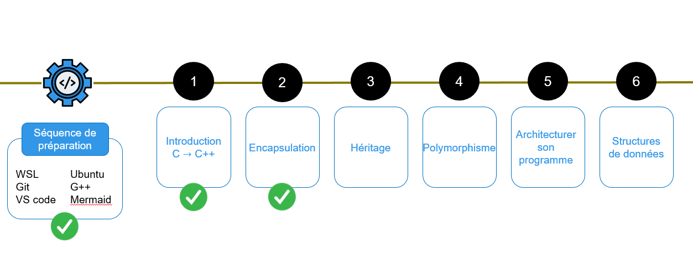

# Bloc POO – EI A2 INFO 2025-2026

## 🎯 Objectif du bloc
L’objectif de ce bloc est de **maîtriser les fondements de la programmation orientée objet (POO)** en **C++**.  
À la fin de ce bloc, vous serez capables de **modéliser et de coder un logiciel complet en C++**, en respectant les standards de conception orientée objet.

---

## Organisation du bloc

Le bloc POO s’articule autour de plusieurs activités :

- **1 séquence de préparation**
- **6 boucles PBL** (Problem-Based Learning) accompagnées de **workshops**
- **2 CCTLs** : ** le **11/12/2025** (session de rattrapage le **08/01/2026**)  
  - Génie logiciel  
  - Notions de POO
- **1 projet final**

📅 **Période :** du **04/11/2025** au **08/12/2025**  

**Projet :**
- Lancement : **24/11/2025**  
- Durée : **2 semaines** (dont 1 dédiée au développement)
- Soutenances : **08/12/2025**

---

## Déroulement pédagogique

Chaque workshop permet de découvrir et de mettre en pratique une notion clé de la POO :



Les **corrections des workshops** seront publiées progressivement dans ce dépôt afin de vous aider à consolider vos connaissances.

---

## Environnement de développement requis

- Un ordinateur portable sous **Windows 10+**, **Linux**, ou **macOS**
- **Terminal** (WSL sous Windows si nécessaire)
- **g++** (`build-essential`)
- **Git**
- **VS Code** (éditeur conseillé)
- Langage : **C++ standard**

⚙️ Reportez-vous au [tutoriel d’installation](ressources/tutoriel_installation_linux_vscode.pdf) pour configurer correctement Linux (WSL) et Visual Studio Code.

---

## Projet final

Le projet constitue la synthèse du bloc.  
Il s’agira de concevoir un **logiciel orienté objet complet en C++**, en appliquant :
- les principes d’encapsulation, d’héritage et de polymorphisme ;
- une architecture modulaire claire ;
- une gestion de code collaborative via Git.

🗓️ **Soutenance du projet :** le **08 décembre 2025**

---

## Structure du dépôt

```bash
.
├── README.md
├── /boucle_1
│   ├── Introduction/
│   ├── partie_1/
│   ├── ...
├── /boucle_2
│   ├── partie_1/
│   ├── partie_2/
│   └── ...
````

## Collaboration

Chaque élève est invité à : 

1. Cloner le dépôt sur sa machine 

```bash
git clone https://github.com/gbencheikh/POO_FISA_A3
````

2. Créer une branche personnelle pour travailler sur les exercices : 

```bash
git checkout -b prenom-nom
````

3. Pousser ses modifications après validation locale : 

```bash
git add .
git commit -m "Ajout de la partie 3 boucle 2"
git push origin prenom-nom
````


